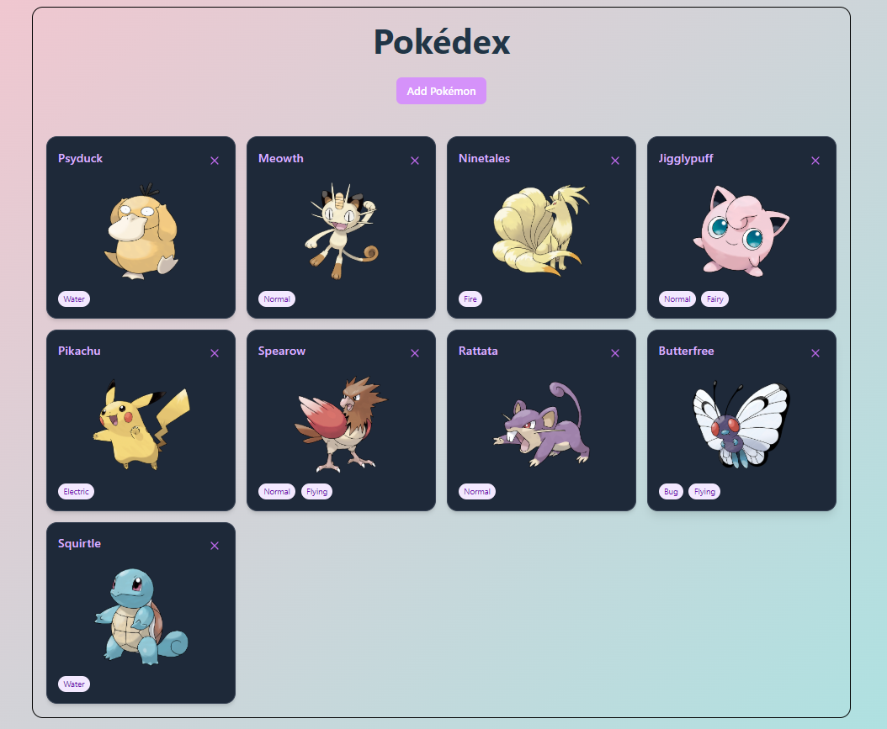
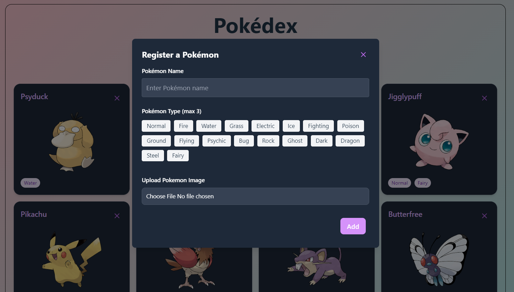
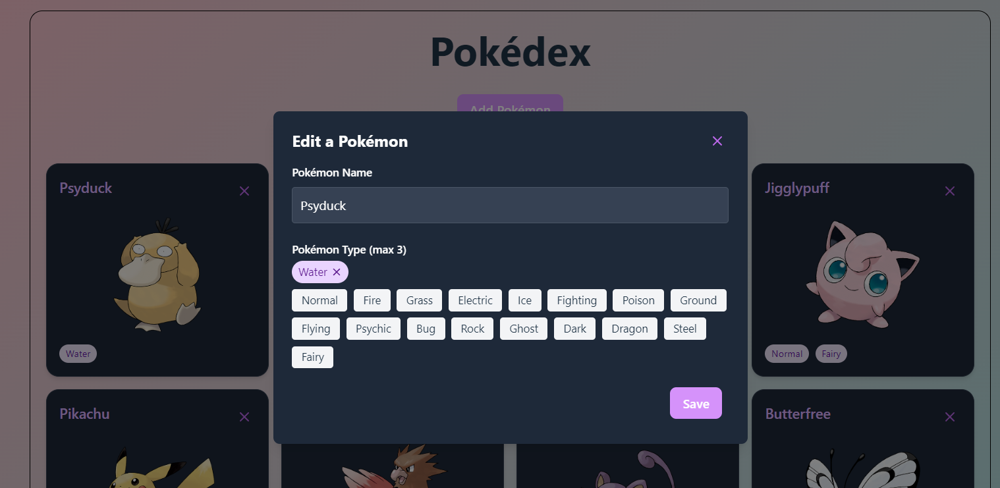
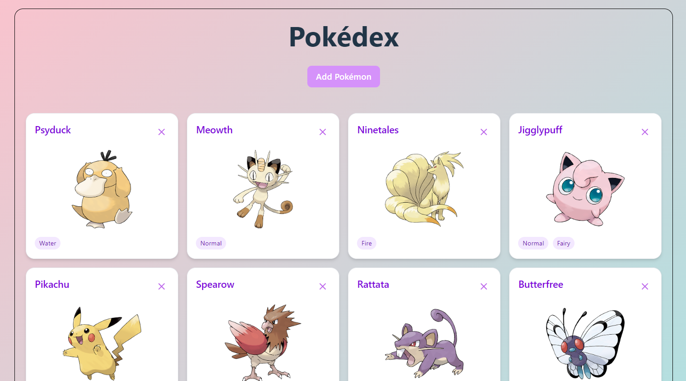
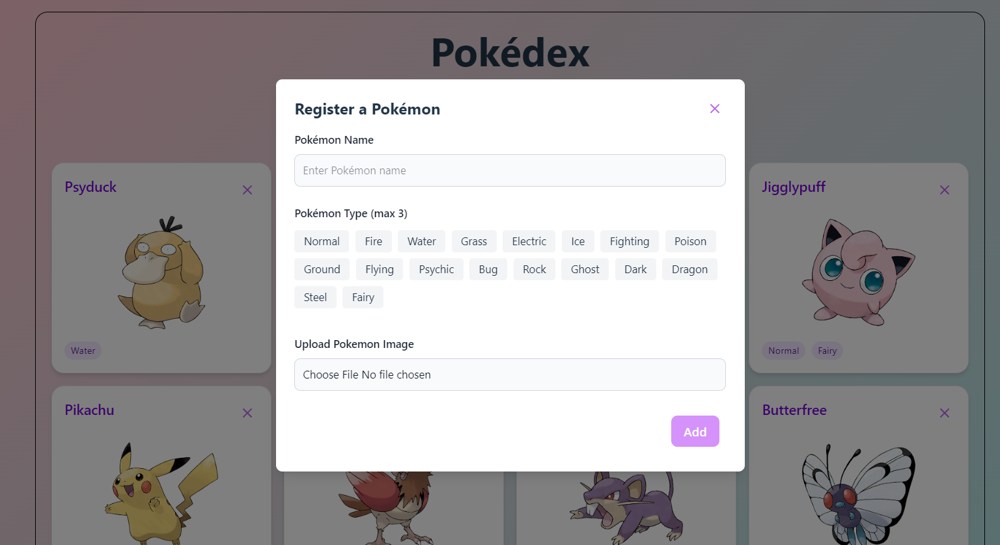
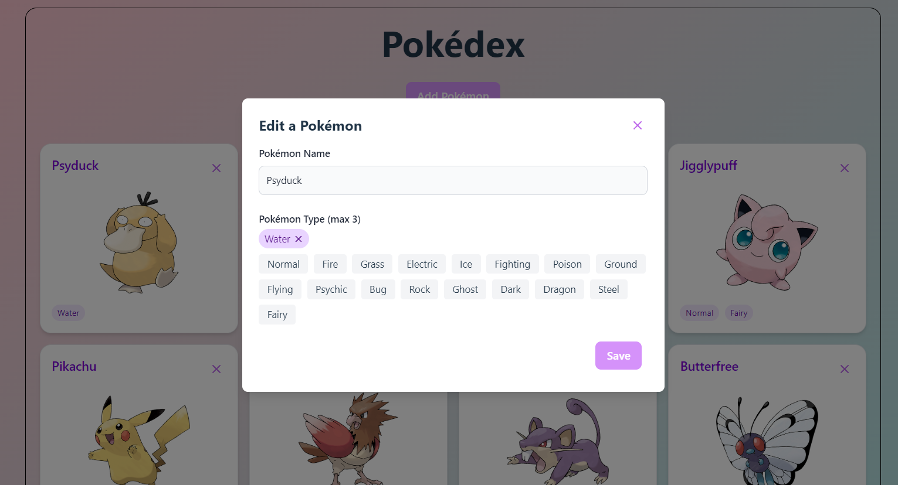

# Pokédex App (MERN)

A full-stack Pokédex built using MERN (MongoDB, Express, React, Node.js) stack. This app allows you to **add your Pokemon character**, **upload image**, and **select pokemon types**. You can also **edit information** like Pokemon name and pokemon type.

Link: [Pokédex App](https://pokedex-mern.netlify.app/)

# Features
- Add Pokédex Character
- Edit Pokemon name and type
- Upload Image 
- Remove Pokemon card

# Installation

## Clone the repository 

- create a folder 
- open a terminal inside that folder
- paste this 

```bash
git clone git@github.com:hannarizza16/todo-list-mern.git
 ```

 ### Backend Setup (Node.js + Express + MongoDB)
 1. go to backend folder 
 ```bash
cd backend-side
 ```

 2. install dependencies  
 ```bash
npm install 
 ```

 3. **create a .env file with your mongoDb connection**
 ```bash
  MONGO_URI=your_mongodb_connection_string
  PORT=8000
 ```

 4. Start the backend server
 ```bash
  npm run dev
 ```

 ### Frontend Setup  
 1. Open a new terminal
 ```bash
 cd client-side
 ```

 2. Install dependencies 
 ```bash
  npm install
 ```

 3. Start the frontend vite-react
 ```bash
  npm run dev
 ```

 # Dependencies (Packages)

 ### Backend (Node.js + Express + MongoDB)
 These are the packages that I have in my project 

 1. express (v4.18.2) - web framework for Node.js

 2. mongoose (v8.6.2)  - MongoDB (to connect and interact with MongoDB)

 3. dotenv (v16.5.0) - for loading variables from .env

 4. cors (v2.8.5) - to allow cross-origin request between frontend and backend

 5. nodemon (dev dependency) (v2.0.20) - to automatically restart server whenever there are changes

 6. mongodb (v6.8.1) — MongoDB native driver (sometimes alongside Mongoose)

 7. cloudinary (v1.41.3) – Handles cloud image uploads

 8. multer (v2.0.1) – Middleware for handling multipart/form-data (file uploads)

 9. multer-storage-cloudinary (v4.0.0) – Integration between Multer and Cloudinary for direct upload


**Install them using your terminal** 
 ```bash
  npm install express mongoose dotenv cors nodemon mongodb cloudinary multer multer-storage-cloudinary
 ``` 

### Frontend (Vite-React)

1. react (v19.0.0)

2. react-dom (v19.0.0)

3. react-router-dom (v7.5.3) — for routing

4. axios (v1.9.0) — for HTTP requests

5. tailwindcss (v4.1.4) — utility-first CSS framework

6. @tailwindcss/forms (v0.5.10) — Tailwind plugin for styling forms

7. @tailwindcss/vite (v4.1.4) — Tailwind plugin for Vite integration

8. lucide-react (v0.513.0) — React icons library

**Install them using your terminal** 
 ```bash
  npm install react react-dom react-router-dom axios tailwindcss @tailwindcss/forms @tailwindcss/vite lucide-react
 ``` 

### Deployment
- Frontend: [Netlify](https://www.netlify.com/)
- Backend: [Render](https://render.com/)

## Tech Stack
### Frontend
- **React**: For building the user interface.
- **Vite**: For fast development and build tooling.
- **Tailwind CSS**: For styling the app.

### Backend
- **Node.js**: For server-side JavaScript.
- **Express**: For building the RESTful API.
- **MongoDB**: For storing tasks in a NoSQL database.
- **Mongoose**: For object data modeling (ODM).
- **Cloudinary**: Cloud-based image and file storage service.
- **Multer** — Middleware for handling file uploads.

# Screenshots

### Pokedex Main Page **(Dark mode)**



### Add Pokemon Modal



### Edit Pokemon Card



### Pokedex Main Page **(Light mode)**



### Add Pokemon Modal



### Edit Pokemon Card

